# MISSONI — Visual DNA

### Measuring color, pattern & design in Missoni womenswear, 2001–2023

*A computer-vision study of what makes a garment recognizably Missoni: 135 runway looks from nine collections, with each garment isolated, measured and compared.*

`Python` · `scikit-learn` · `SegFormer` · `CLIP` · `ONNX Runtime` · `matplotlib` · `Gradio`

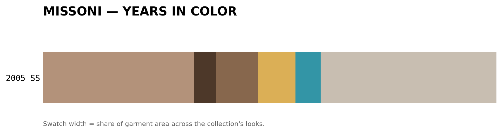

---

## In short

1. **What makes it Missoni is the knit, not the color.** Remove all color and a look stays recognizably Missoni. Blur away the knit pattern while keeping color, shape and drape, and the resemblance disappears. → [06](#06--what-makes-it-missoni)
2. **Every show has a signature, but there is no timeline.** A model names a look's collection 42% of the time (10% by chance), yet the collections don't drift in one direction over the years: the house moves between recurring looks. → [05](#05--missonis-eras)
3. **The zigzag comes back.** It is strong in 2001–2003, gives way to prints (2008, 2014) and stripes (2016), then returns in FW 2023 (7 of 15 looks), the collection that also sits closest to FW 2001. → [02](#02--pattern-dna), [04](#04--evolution-vs-consistency)
4. **Color peaked in 2008.** Median colorfulness rose through the 2000s, then fell by about half after 2011. SS 2019 is the most muted collection, with no vivid accent at all. → [01](#01--the-colors-of-missoni)
5. **A trap avoided: the model was recognizing the room.** Shown full runway photos, CLIP "identifies" the collection 98% of the time by recognizing each show's venue. All findings use garment-only images. → [05](#the-venue-trap)

---

## The question

**Can data and computer vision measure what makes a garment recognizably Missoni?**

The house is known for zigzags, space-dyed stripes and dense color compositions. This project measures how much of that identity can be read from runway images alone, and how it has shifted across two decades of womenswear.

| | |
|---|---|
| **Data** | 135 runway looks: 15 sampled evenly from each of 9 collections, FW 2001 – FW 2023 ([Archivio Missoni](https://www.archiviomissoni.org) lookbooks) |
| **Garment isolation** | SegFormer-B2 clothing segmentation: every measurement uses garment pixels only |
| **Features** | color (k-means, CIELAB histograms, colorfulness), pattern (edge density, edge direction), CLIP image embeddings |
| **Analysis** | nearest-neighbour recognition with permutation tests, PCA, collection distances, classification, ablation |

---

## 01 — The Colors of Missoni

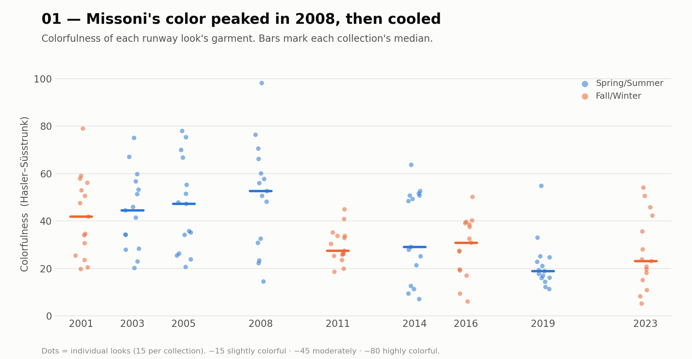

Warm rust, camel and brown dominate the early 2000s; teal and coral accents arrive in 2005–2008; dusty mauve, grey and near-neutrals take over from 2011 (palette chart at the top). Median colorfulness climbs from 42 (FW 2001) to **52 (SS 2008)**, then falls to 19–31.

<details><summary>Every look in its own colors</summary>

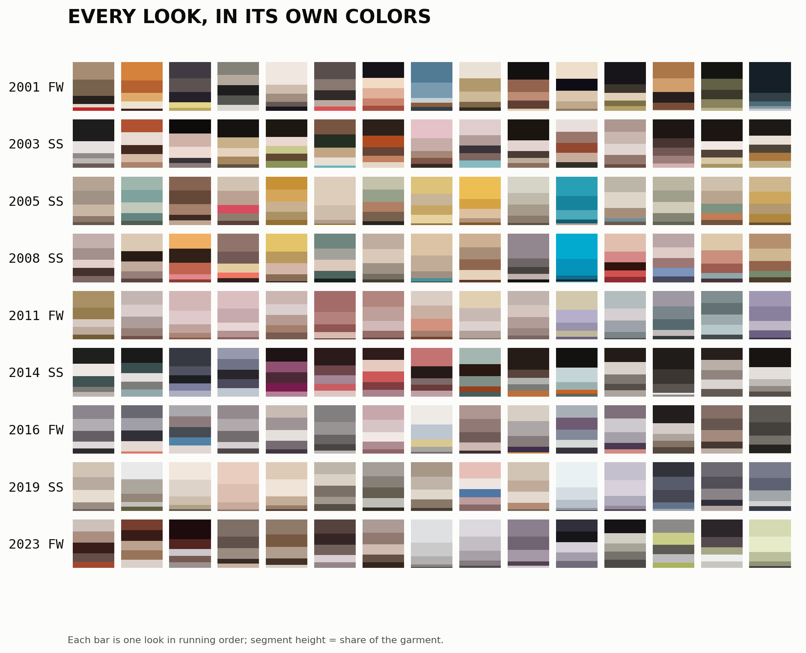

</details>

## 02 — Pattern DNA

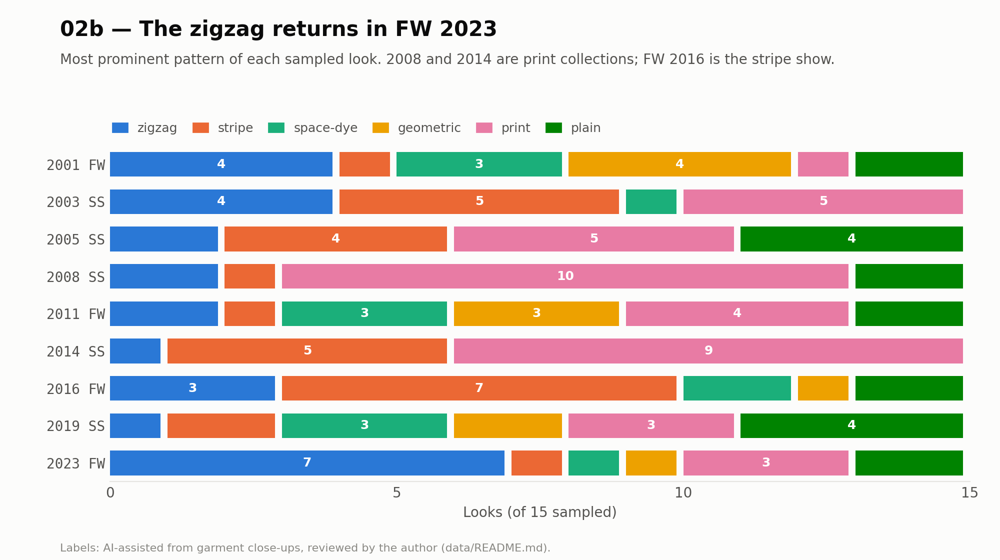

Each look's most prominent pattern ([definitions](data/README.md#pattern-labels); AI-assisted labels, reviewed by the author) shows the house cycling through patterns: prints dominate SS 2008 (10 of 15) and SS 2014 (9), stripes dominate FW 2016 (7), and **the zigzag returns in FW 2023 (7 of 15)**.

<details><summary>Can a model learn the pattern types?</summary>

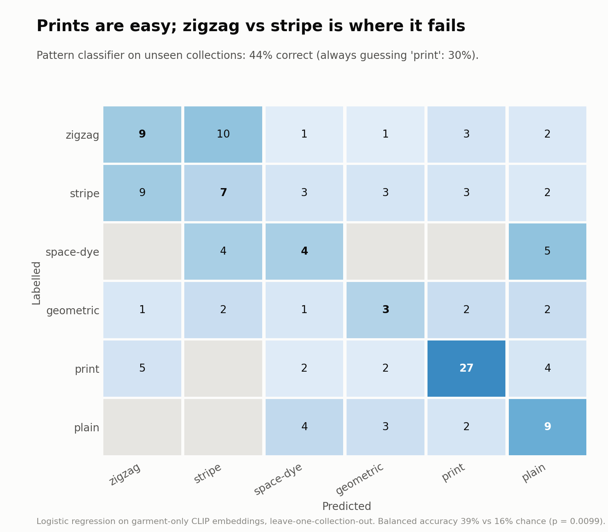

A logistic regression on garment-only CLIP embeddings, tested on collections it never saw, gets **44% right vs 30%** for always guessing "print" (balanced accuracy 39% vs 16% chance, p < 0.01). Prints are easy (68%). The main failure is **zigzag vs stripe**: at CLIP's 224-pixel input a fine zigzag reads as a stripe, and many looks mix the two. Treating zigzag, stripe and space-dye as one "knit pattern" class raises accuracy to 64% (baseline 49%).

</details>

<details><summary>Pattern density and stripe-likeness by look</summary>

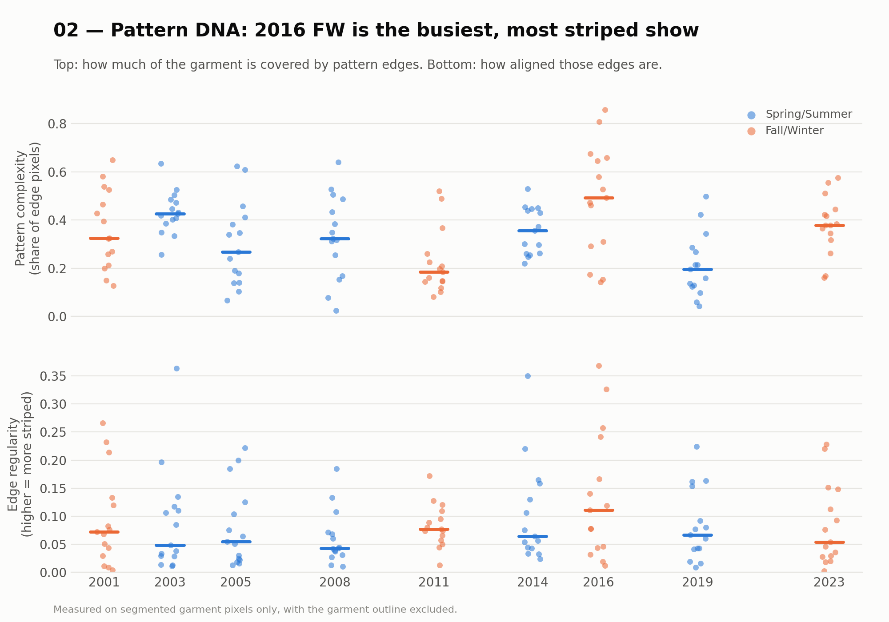

FW 2016 is the busiest and most striped collection (median pattern complexity 0.49). FW 2011 and SS 2019 are the plainest.

</details>

## 03 — Visual Complexity

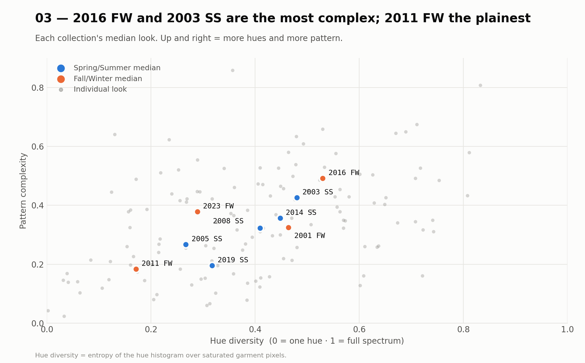

Color variety and pattern density rise together. SS 2003 and FW 2016 sit at the complex end and FW 2011 at the minimal end.

<details><summary>A season signal: how much skin the runway shows</summary>

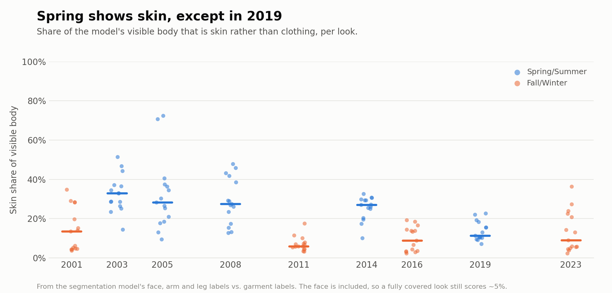

Spring/Summer looks show 27–33% skin, against 6–14% for Fall/Winter. **SS 2019 is the exception at 11%**, as covered-up as a winter show and consistent with its muted palette.

</details>

## 04 — Evolution vs. Consistency

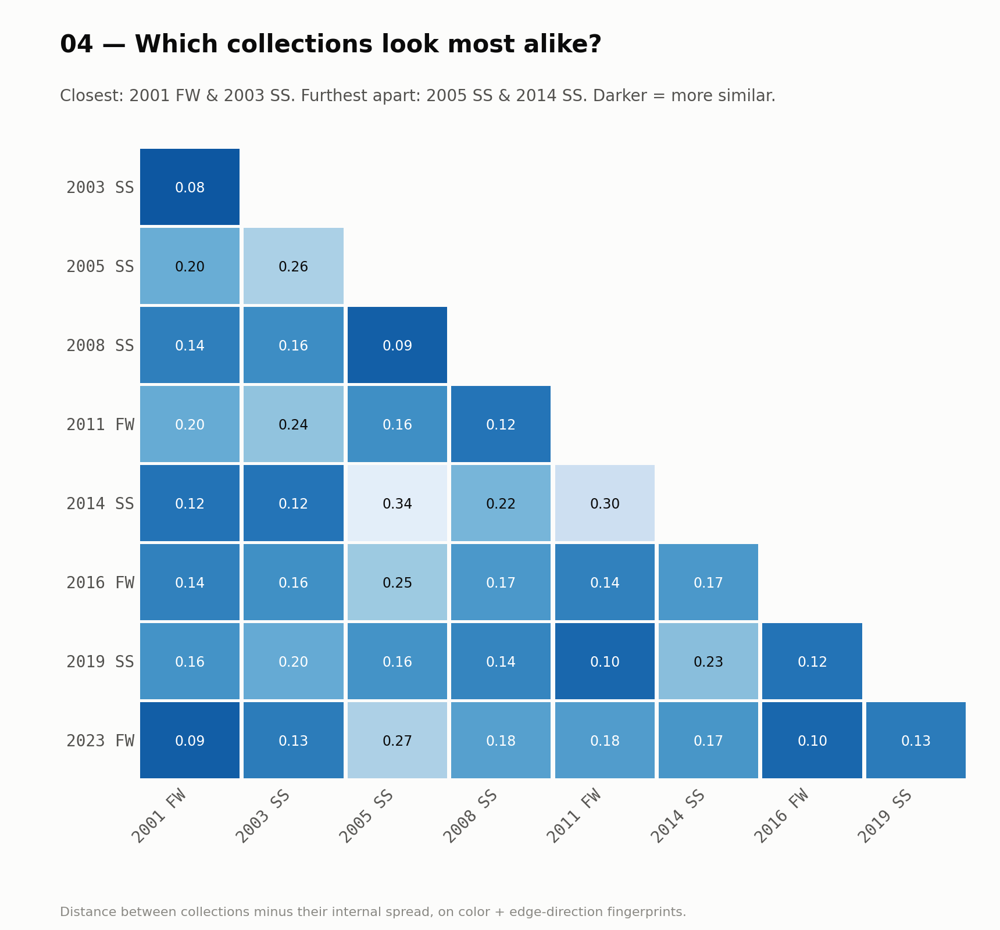

Each look gets a visual fingerprint (a CIELAB color histogram plus a histogram of edge directions). The closest pair is **FW 2001 & SS 2003**, and the next is **FW 2023 & FW 2001**: the most recent collection looks back to the house's early-2000s palette. SS 2005, with its pale gold and turquoise chiffons, is the outlier.

## 05 — Missoni's Eras

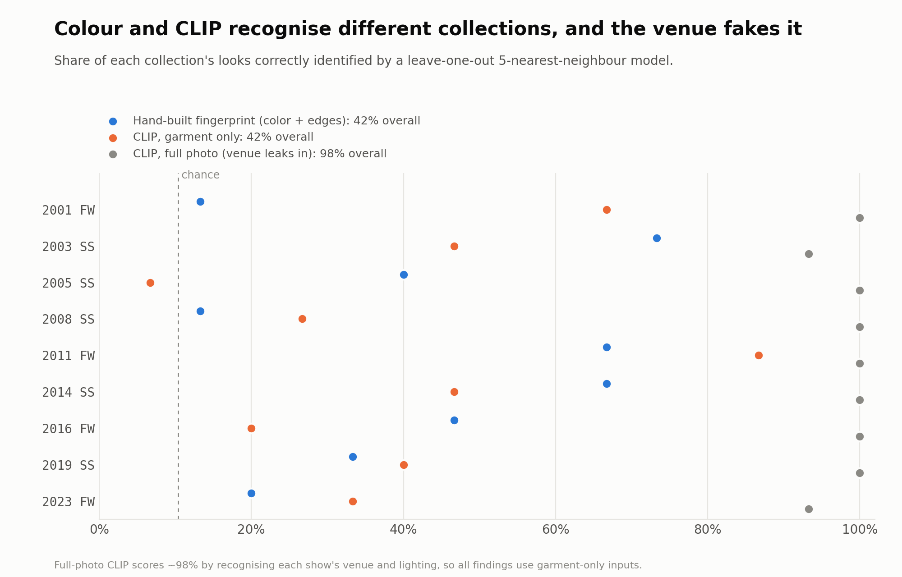

- **Each show has a signature.** Given a look it hasn't seen, a 5-nearest-neighbour model names its collection **42% of the time vs 10% by chance** (permutation test, p = 0.005), both with the color fingerprint and with CLIP.
- **The two see differently.** Color recognizes SS 2003 and SS 2014 best; CLIP recognizes FW 2011 (87%) and FW 2001 (67%) best, and groups collections by silhouette and season (summer dresses together, winter knit coats together). Combined, they reach 47%.
- **There is no timeline.** Collection centres zigzag across the map instead of drifting in one direction, and neither main axis correlates with year (|r| < 0.2).

#### The venue trap

Shown the **full runway photo**, CLIP identifies the collection **98%** of the time, because each show has its own set, lighting and crowd. Those full photos also produce a convincing year trend (r = 0.54) that vanishes once the venue is removed: it came from changing photography, not fashion. Every result here therefore uses **garment-only** images (segmented, on a neutral background).

<details><summary>Era maps and per-collection results</summary>

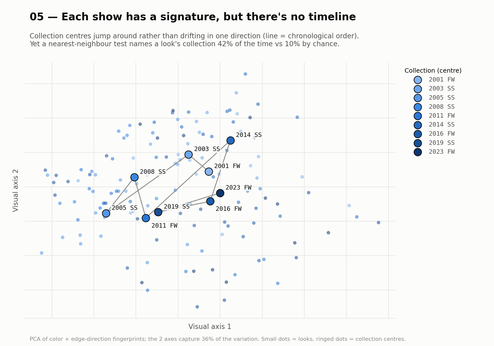
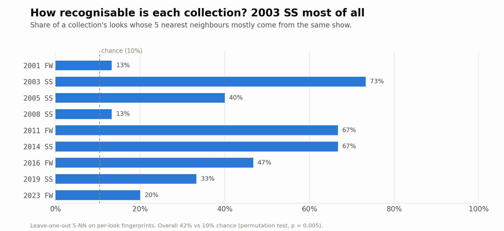
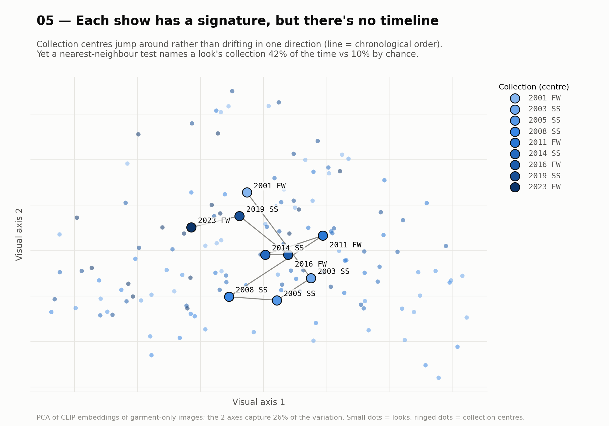
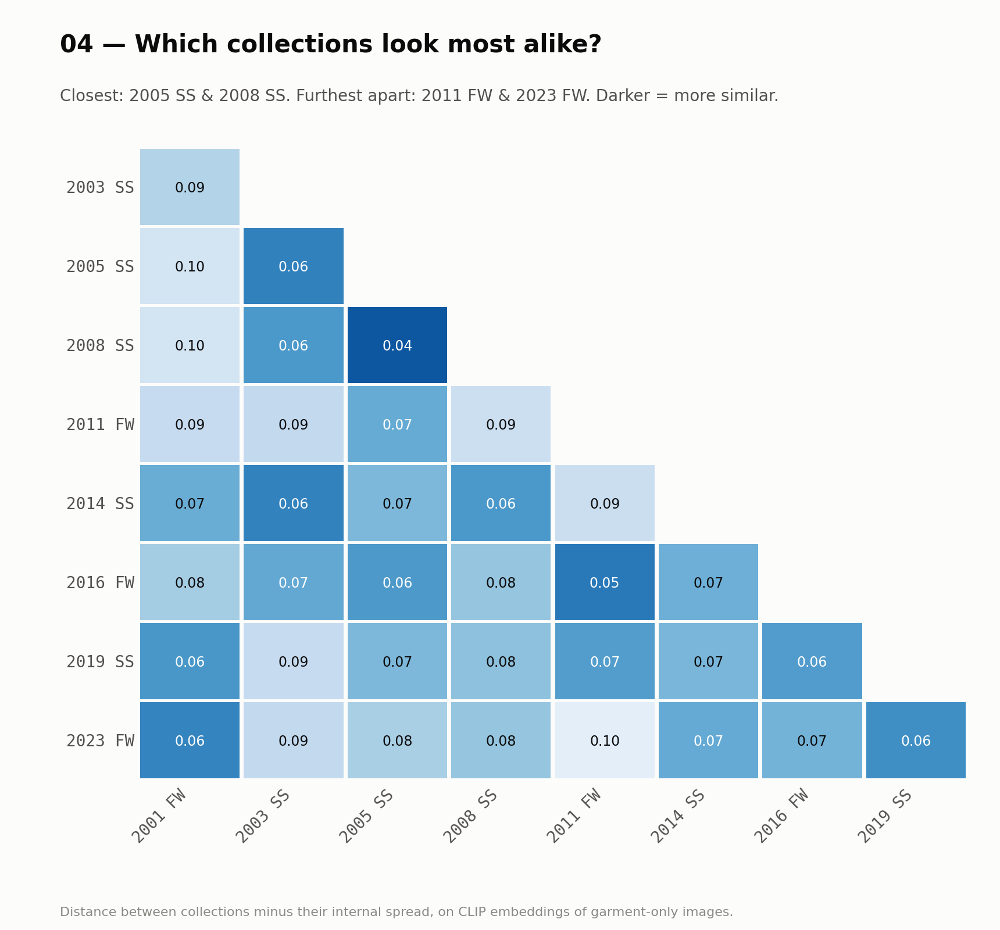

</details>

## 06 — What makes it Missoni?

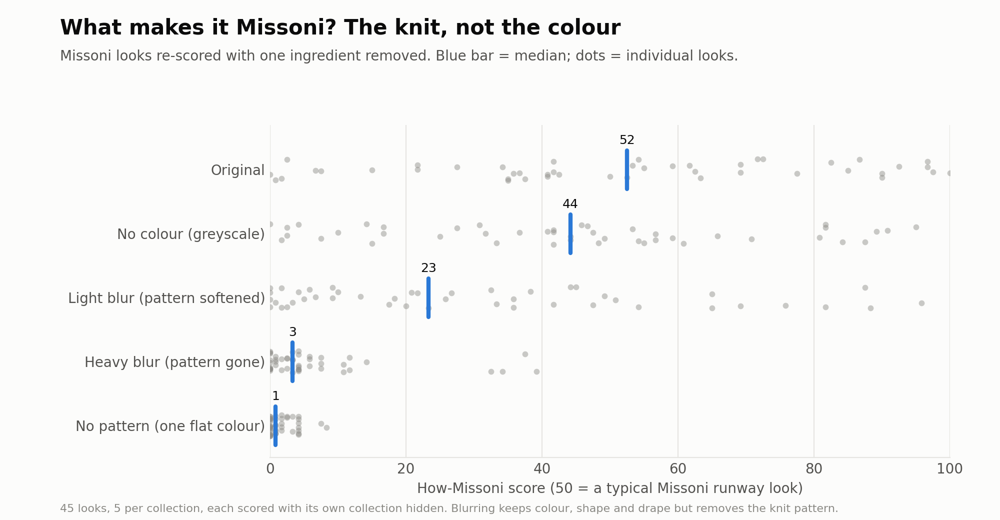

The [demo](#demo-how-missoni-is-this) scores how close a garment is to the archive, calibrated so that **50 = a typical Missoni runway look**. Re-scoring 45 Missoni looks with one ingredient removed at a time:

| removed | median score |
|---|---|
| nothing | 52 |
| all color (greyscale) | 44 |
| fine detail (light blur) | 23 |
| the knit pattern (heavy blur; color and drape kept) | 3 |
| everything but one flat color | 1 |

**To the model, Missoni-ness lives in the knit pattern, not the palette.** Together with chapter 05: **color tells Missoni collections apart; pattern is what makes them Missoni.**

---

## Demo: How Missoni Is This?

```bash
python app.py   # then open http://127.0.0.1:7860
```

Upload an outfit photo. The app isolates the garment, embeds it with CLIP and returns a 0–100 score, the closest Missoni collection, the garment's palette and its nearest archive looks. Command-line version: `python src/how_missoni.py photo.jpg`. *For fun and learning. It cannot authenticate anything.*

---

## Method

```
lookbook PDF ──► full-length looks ──► segment garment ──► measure ──► analyse
                (auto-filtered)        (SegFormer-B2)      color         recognition (k-NN + permutation test)
                                                           pattern       similarity, PCA
                                                           CLIP          classification, ablation
```

- **Sampling.** 15 looks per collection, evenly spaced through each show rather than hand-picked. Lookbooks mix runway shots with close-ups, so pages are filtered automatically to full-length, front-facing looks ([`import_lookbook.py`](src/import_lookbook.py)).
- **Garment isolation.** [SegFormer-B2](https://huggingface.co/mattmdjaga/segformer_b2_clothes) labels every pixel as garment, skin, hair or background, so the runway floor, other models and skin never enter the measurements. It replaced a first approach (fixed crop + skin-tone mask) that is kept as a fallback.
- **Color.** k-means dominant colors with real-color (medoid) swatches, CIELAB histograms, Hasler–Süsstrunk colorfulness, hue entropy.
- **Pattern.** Edge density and edge-direction histograms on the garment interior.
- **Embeddings.** CLIP ViT-B/32 on garment-only images, compared against the hand-built fingerprints.
- **Statistics.** Leave-one-out and leave-one-collection-out evaluation, with permutation tests against shuffled labels.

<details><summary>Feature reference</summary>

| feature | what it captures | range |
|---|---|---|
| `silhouette_auto` | outfit shape, from the garment classes found | `dress`, `top+skirt`, `top+trousers`, … |
| `skin_share` | share of the visible body that is skin | 0–1 |
| `color_1…5` + `_share` | five dominant colors and their garment share | hex, 0–1 |
| `colorfulness` | chromatic intensity | 0 (grey) → 100+ |
| `brightness`, `saturation` | mean HSV value and saturation | 0–1 |
| `hue_diversity` | entropy of the hue histogram | 0 (one hue) → 1 (full spectrum) |
| `pattern_complexity` | share of garment pixels on a strong edge | 0 (plain) → high (dense knit) |
| `edge_regularity` | how aligned the edges are | higher = more striped |

</details>

<details><summary>Why garment isolation matters (before/after)</summary>

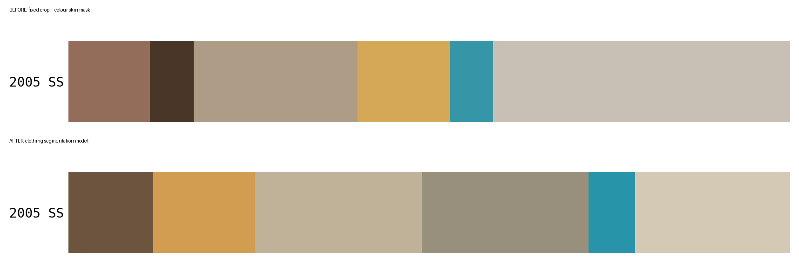

</details>

## Limitations

- **Sample size.** 15 looks × 9 collections. Collection-level findings are indicative, and per-collection percentages are noisy.
- **Coverage.** The online archive starts in 2001, so the Ottavio & Rosita years (1953–1997) are not covered. The SS 2019 show was co-ed and its lookbook includes menswear.
- **Photography.** Scanned film in 2001–2003, then digital, with a different venue and lighting every season. Garment-only inputs remove the venue, but lighting still affects measured color.
- **Models.** The segmentation model was trained on everyday clothing: it treats swimwear as `top` and sheer fabric over skin as garment. CLIP sees images at 224 px, which blurs fine knit patterns.
- **Labels.** Pattern labels are AI-assisted and reviewed by one person; pattern boundaries (zigzag vs stripe, print vs geometric) are partly subjective.

## Data & credits

Runway images: [Archivio Missoni](https://www.archiviomissoni.org) lookbooks. The images stay local and are never committed; the repo publishes only source links and the numbers derived from them ([`data/README.md`](data/README.md)).

| collections | creative direction |
|---|---|
| FW 2001 – SS 2019 | Angela Missoni |
| FW 2023 | Alberto Caliri |

Models: SegFormer-B2 clothes ([mattmdjaga](https://huggingface.co/mattmdjaga/segformer_b2_clothes), NVIDIA SegFormer licence, non-commercial) and CLIP ViT-B/32 (OpenAI, MIT; [Xenova ONNX export](https://huggingface.co/Xenova/clip-vit-base-patch32)), both run locally with ONNX Runtime.

<details><summary>Reproduce</summary>

```bash
pip install -r requirements.txt
python src/import_lookbook.py pages data/lookbooks/<file>.pdf     # review a lookbook
python src/import_lookbook.py import data/lookbooks/<file>.pdf --year … --season … --era … --first 2
python src/extract_features.py    # -> data/missoni_dataset.csv (first run downloads the 110 MB segmentation model)
python src/palette_strips.py      # -> palette charts
python src/chapter_charts.py      # -> chapters 01–03
python src/embeddings.py          # -> hand-built fingerprints
python src/clip_embeddings.py     # -> CLIP embeddings (first run downloads the 352 MB model)
python src/era_analysis.py        # -> chapters 04–05; also: clip, clip_fullframe, compare
python src/pattern_analysis.py    # -> chapter 02 pattern mix + classifier
python src/ablation.py            # -> chapter 06
python review_labels.py           # review pattern labels at http://127.0.0.1:7861
```

</details>

## Next

- [ ] Host the demo on Hugging Face Spaces
- [ ] Test the demo score on non-Missoni knitwear
- [ ] Extend to the Ottavio & Rosita era (pre-2001) from other sources

---

*Part of a portfolio on data × culture × creativity — [madeleinelacoste](https://github.com/madeleinelacoste)*
